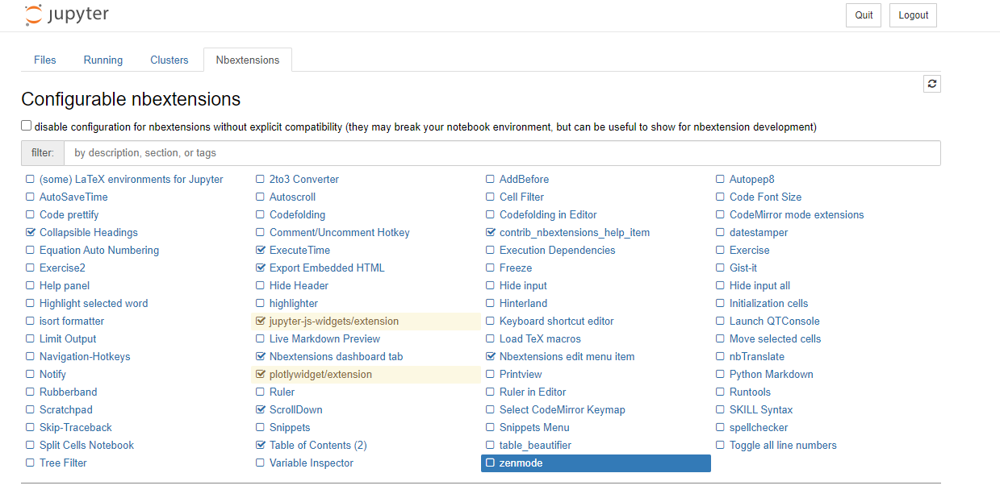

# Stellantis Data Science Template

This is a standard template for data science projects. Its purpose is to meet
the needs of the data scientists and also the DDCE requirements. This example
should be considered as a starting point and changed based upon the evolution
of the project.

This template is compatible only with **Python3** and **Spark2**.

## Table of contents

<!--ts-->
   * [Template Tree](#template-tree)
   * [Getting started](#getting-started)
      * [Application and package names](#application-and-package-names)
      * [Create a new project repository on GitHub](#create-a-new-project-repository-on-gitHub)
      * [Clone the project repository and rename the package](#clone-the-project-repository-and-rename-the-package)
   * [Environment setup](#environment-setup)
      * [Python3 virtual environment](#python3-virtual-environment)
      * [User specific settings](#user-specific-settings)
   * [Working on the project](#working-on-the-project)
      * [Launch a Jupyter notebook](#launch-a-jupyter-notebook)
      * [Tutorial Notebooks](#Tutorial-Notebooks)
      * [Launch an Azure Machine Learning Experiment](#launch-an-azure-machine-learning-experiment)
      * [Store the data](#store-the-data)
      * [Application logs](#application-logs)
      * [Data configuration files](#data-configuration-files)
      * [Unit tests](#unit-tests)
      * [Clean the environment](#clean-the-environment)
      * [Format code](#format-code)
      * [Git management](#git-management)
      * [Git commit message guidelines](#git-commit-message-guidelines)
   * [Industrialization](#industrialization)
      * [Continuous integration](#continuous-integration)
      * [Scheduling job](#scheduling-job)
<!--te-->


## Template Tree

```
├── app_template                        <- Python package - scripts of the project
│   ├── configuration                   <- Setup configs
│   │   ├── resources                   <- Data configuration files
│   │   │   └── infra.json              <- Infra configuration file
│   │   ├── app.py                      <- Environment configuration
│   │   ├── data.py                     <- Data configuration
│   │   ├── mail.py                     <- Mailer class to send emails
│   │   └── spark_config.py             <- Module to create a Spark application
│   ├── domain                          <- Business needs modelling
│   │   └── kpi.py                      <- Example domain function that builds business KPIs
│   ├── infra                           <- Connexion to the data
│   │   ├── repositories                <- Handle reading & preprocessing of data sources
│   │   │   └── flow_repository.py      <- Example repository
│   │   ├── anonymizer.py               <- Class to anonymize data
│   │   └── oracle_database.py          <- Class to read/write data in Oracle
│   │   └── sftp.py                     <- Class to download/upload file from/to sftp server
│   ├── interface                       <- Interaction with user
│   │   └── notification.py             <- Module to send notification after job execution
│   ├── pipeline                        <- Pipelines of the application
│   │   ├── azureml                     <- Azure ML scripts
│   │   └── app_pipeline.py             <- Example pipeline
│   └── utils                           <- Useful transversal functions
│       └── system.py                   <- System functions
│
├── conf                                <- Environment configuration files
│   ├── environment                     <- User specific settings
│   │   ├── development.yml.sample      <- Development environment sample where you have to fill in the user settings
│   │   └── preproduction.yml.sample    <- Preproduction environment sample where you have to fill in the user settings
│   └── logging.conf.yml                <- Setup how to monitor the logs of the application
│
├── notebook                            <- Notebooks for analysis and testing
│   └── _tutorial                       <- Tutorial notebooks
│       ├── 01_Read_Write_Data.ipynb    <- Read & Write data
│       └── 02_Example_Pipeline.ipynb   <- Steps of the example pipeline
│       └── 03_Use_SFTP_Server.ipynb    <- Download/upload files using a sftp server
│       └── 04_Dataframe_Analysis.ipynb <- First quick data analysis on a dataframe
│
├── script                              <- Shell scripts of the application
│   ├── app-profile.sh                  <- Set environment variables needed for the application
│   ├── change_name.sh                  <- Rename package
│   ├── notebook.sh                     <- Launch python notebook
│   ├── set_version.sh                  <- Setup the version of the package for release
│   ├── set_virtualenv.sh               <- Setup virtualenv environment
│   └── start.sh                        <- Example start script
│
├── test                                <- Unit tests
│   ├── domain                          <- Domain unit tests
│   │   └── test_kpi.py                 <- Unit tests of the domain/kpi.py script
│   ├── infra                           <- Infra unit tests
│   │   └── repositories                <- Repositories unit tests
│   │       └── test_flow_repository.py <- Unit tests of the FlowRepository class
│   └── resources                       <- Test resources
│       └── flow.csv                    <- Resource file containing production flow data
│
├── .gitignore                          <- Files that should be ignored by git
├── CICD.md                             <- Documentation on how to set CI/CD
├── GIT.md                              <- Documentation on how to organize Git branches
├── Makefile                            <- Executable to run commands of the project
├── MANIFEST.in                         <- Describe resources files to include in the package for release
├── README.md                           <- The top-level README of the repository
├── requirements.txt                    <- Python libraries used in the project
└── setup.py                            <- Script to build the package
```


## Getting started

This git repository is a template for data science projects. To create a project
based on this template, please execute the following steps.

### Application and package names

- *Application name*: repository name on GitHub. Every Stellantis application follows the
same naming convention. It is composed of a trigram (`prd`) followed by two digits
(usually `00` if it's the first version of the application). The `prd` should meet
several requirements:
  - composed of exactly 3 alpha characters
  - should not already exist: see this [link](http://reflex.inetpsa.com/PV4/Applications/Prd?area=Applications)
  to verify that the prd is available
  - should be meaningful (e.g. *rep* for *reporting* is too general)

- *Package name*: python package which will contain all the scripts.
The requirements are as follows:
  - short
  - lowercase letters
  - no space, use `_` instead (and not `-`)
  - no accent
  - can't start with a digit

- Example:
  - *Application name*: `app00`
  - *Package name*: `app_template`

### Create a new project repository on GitHub

Create an empty repository on GitHub with the following parameters:
- *Repository template*: brc14/python-datascience-template
- *Owner*: choose the BRC related to the project (or your personal user)
- *Repository name*: the repository name you choosed (with format `prd00`)
- *Description*: add a description of the project
- Choose *Public*

### Clone the project repository and rename the package

The repository created above exists as a *remote* repository. To be able to work
on it from ARC, you have to create a *local* copy by cloning it.

Click on `Clone or download`, and copy the SSH url from the `Clone with SSH` window.
In your terminal, please run the following command.
```
$ git clone <SSH url>
```
NB: if you have problems cloning the project using SSH protocol, then your SSH key
may not be properly configured. Please see the documentation at this [link](https://shiftup.sharepoint.com/sites/datascience/_layouts/15/Doc.aspx?sourcedoc={76cd4b2b-c68d-4dc7-b029-910c4869324c}&action=edit&wd=target%28Technical%20Kit.one%7C4292f160-b6f8-4df4-8fa4-b076bffa6d8c%2F5.2.1.%20SSH%20connection%7C3396b4a5-79b8-4713-a702-1360b437e23d%2F%29)
to configure it.

Second, use the command `rename` defined in the Makefile. At the invitation,
please enter the initial name of the package (by default `app_template`)
and then the new name (`package_name`).
```
$ cd prd00
$ make rename
What is the initial name?
$ app_template
What is the new name?
$ package_name
```

Third, commit your changes.
```
$ git add .
$ git commit -m "MNT: rename python package"
$ git push
```


## Environment setup

### Python3 virtual environment

This command will install a Python3 environment with all the python libraries
set by default in *requirements.txt*.
```
$ make install
```
Feel free to add any library in the *requirements.txt* file that you may need
in the project, and then run again the command above.

To activate the environment:
```
$ source script/app-profile.sh
```

### User specific settings

The subfolder `conf` contains the environment configuration.
```
├── conf                                <- Environment configuration files
    ├── environment                     <- User specific settings
    │   ├── development.yml.sample      <- Development environment sample where you have to fill in the user settings
    │   └── preproduction.yml.sample    <- Preproduction environment sample where you have to fill in the user settings
    └── logging.conf.yml                <- Setup how to monitor the logs of the application
```
To configure the user settings, create a `development.yml` file or
`preproduction.yml` file, depending on which environment you are working on
(development or preproduction). Use the `chmod 600` command to withdraw access
(read & write) to everyone except you.
```
$ cd conf
$ cp environment/development.yml.sample environment/development.yml
$ chmod 600 environment/development.yml
```
Then, edit `development.yml` and fill in your user settings. To get the credentials
needed for the *brcdb* section, please see this [note](https://shiftup.sharepoint.com/sites/datascience/_layouts/15/Doc.aspx?sourcedoc={76cd4b2b-c68d-4dc7-b029-910c4869324c}&action=edit&wd=target%28Technical%20Kit.one%7C4292f160-b6f8-4df4-8fa4-b076bffa6d8c%2F3.1.%20BRCs%7Cbcc262b3-a970-48ce-bed2-7b7622072e38%2F%29)
of the Technical Kit.

Last, create the symbolic link `application.yml` of the `development.yml` file.
```
$ pwd
/gpfs/user/uXXXXXX/prd00/conf
$ ln -s environment/development.yml ./application.yml
```
It means that the `application.yml` file is like an alias of the
`development.yml` file. If you change anything in the `development.yml` file,
the modification will also be recorded in the `application.yml` file.

The new tree structure of the `conf` directory should be now:
```
├── conf                           
   ├── environment                 
   │   ├── development.yml
   │   ├── development.yml.sample  
   │   └── preproduction.yml.sample   
   ├── application.yml          
   └── logging.conf.yml            
```
If you are in the *preproduction* mode, you just have to replace `development` by
`preproduction` in the previous commands.


## Working on the project

### Launch a Jupyter notebook

To install Jupyter and launch a notebook, run the following command.
A password is required to lock the notebook, you can set the password you want.
```
$ pwd
/gpfs/user/uXXXXXX/prd00
$ make notebook
```
NB: If it's the first time that you launch a Jupyter notebook on ARC, please
run the two following commands before:
```
$ cp -fR /gpfs/user/common/jupyter $HOME
$ cp -fR $HOME/jupyter/template/.jupyter $HOME
```

By default, notebooks are not tracked by git. If you want to add a specific one
still (for example a demo notebook), force git to add it:
```
$ git add -f notebook/notebook_to_add.ipynb
```

If you want to activate the notebook extensions such as the table of content and the execution time,
then go to the "Nbextensions" tab of your jupyter notebook home and select the corresponding checkbox as shown below.




### Tutorial Notebooks
The following tutorial notebooks are available to facilitate your project:
|Notebook| Comments|
|---|---|
|01_Read_Write_Data.ipynb|Shows how to Read & Write data in HDFS or Oracle.|
|02_Example_Pipeline.ipynb|Explains all the different steps of the example pipeline located in app_template/pipeline/app_pipeline.py.|
|03_Use_SFTP_Server.ipynb|Details how to download/upload files using a sftp server.|
|04_Dataframe_Analysis.ipynb|Shows how to get quick first usefull analytics on a dataframe.|


### Launch an Azure Machine Learning Experiment

To connect to Azure Machine Learning on ARC, you need to configure the proxy by executing the following command:

```
$ source script/set_proxy.sh
```
NB: The script will ask for credentials. Warnings are explicit in the script, please read them carefully.

An example pipeline is given in `app_template/pipeline/azureml/azureml_pipeline.py`, which trains a RandomForestClassifier
on the MNIST dataset. Following arguments are available:
```
positional arguments:
  experiment_name       Name of the experiment where the job will run

optional arguments:
  --model-name MODEL_NAME
  --n-estimators N_ESTIMATORS
  --max-depth MAX_DEPTH
```

For example, a command could be:
```
$ python app_template/pipeline/azureml/azureml_pipeline.py app00_azureml --model_name model_random_forest_app00 --n_estimators 10 --max_depth 10
```

### Store the data

The `data/` directory should be located in the root directory of the application
(`/gpfs/user/uXXXXXX/prd00`). A structure for the `data` directory could be:
```
├── data                           
   ├── raw               <- Raw data from the databases
   ├── standard          <- Standard data (data quality, validation, common format)
   └── refined           <- Final tables of the project
```

### Application logs

To save the logs of the application, you have to import the class AppConfig
in your main script:
```
$ from app_template.configuration.app import AppConfig
```
Then, instantiate AppConfig at the beginning of your main function:
```
$ AppConfig()
```
To see the logs during the execution of your program:
```
$ pwd
/gpfs/user/uXXXXXX/prd00
$ tail -f log/app_template.log
```

### Data configuration files

The data configuration files should be located in the `app_template/configuration/resources` directory.
The recommended format is `json`.

To retrieve the information from the configuration files in the python package,
please configure the `DataConfig` class located in `app_template/configuration/data.py`.
The information will be available as class attributes.

To use the class in your main script (example given according to the `infra.json` file
located in the `app_template/configuration/resources` directory):
```
$ from app_template.configuration.data import DataConfig
$ data_config = DataConfig()

$ data_config.infra_config
{
  'flow': {
    'input_dirpath': '/user/brc05/data/refined/manf001_vehc_prdc_flow/year=2021/month=01',
    'output_filename': 'production_details',
    'perimeter': {'site_code': ['PY'],
    'genr_door': 'SMON',
    'start_date': '2021-01-18',
    'end_date': '2021-01-21'},
    'columns': ['site_code', 'faml_grp_labl', 'vin', 'pass_date']
  },
  'kpis': {'table_name': 'app00_prdc_kpis'}
}
```

### Unit tests

The unit tests of the application should be located in the `test` directory.
To launch the tests:
```
$ pwd
/gpfs/user/uXXXXXX/prd00
$ make test
```

Note: The [`pytest-spark`](https://pypi.org/project/pytest-spark/) package, included in the dependencies,
exposes a global `spark_session` fixture that creates a Spark session for unit tests. See
`test/infra/repositories/test_flow_repository.py` to see how to use it.

### Clean the environment

If you want to clean the environment, use the command:
```
$ pwd
/gpfs/user/uXXXXXX/prd00
$ make clean
```
It will delete all the *.pyc* files and the *cache* folders.

### Format code

To format the code using PEP8 and PEP256 rules:
```
$ pwd
/gpfs/user/uXXXXXX/prd00
$ make format
```
Warning: this command will reformat every python files in the package!
If you want to format a specific file, use the command directly.
```
$ source script/app-profile.sh
$ black <filename>.py
```

### Git management

Go to this [section](GIT.md) to learn how to organize branch in Git.

### Git commit message guidelines

The purpose of a git commit message is to summarize what you changed and why.
Committing regularly allows the other users to easily follow the development of
the code and to rework on it. To allow a good understanding of the commit
messages, the following structure has been adopted:
```
<type of change> <scope>: <description of the change>
```
where `<type of change>` can be taken from the table below (adapted from
numpy developer guide). The last column corresponds to the legacy acronym
system,

| <type of change> | Description                                        | Legacy acronyms |
|------------------|----------------------------------------------------|-----------------|
| API              | an (incompatible) API change                       |                 |
| BENCH            | changes to the benchmark suite                     |                 |
| BLD              | change related to building/CI                      |                 |
| FIX              | bug fix                                            | fix             |
| DEP              | deprecate something, or remove a deprecated object |                 |
| DOC              | documentation                                      | doc             |
| ENH              | enhancement                                        | feat           |
| MAINT (or MNT)   | maintenance commit (refactoring, typos, etc.)      | refactor, minor |
| REV              | revert an earlier commit                           |                 |
| STY              | style fix (whitespace, PEP8)                       | style           |
| TST              | addition or modification of tests                  | test            |
| REL              | related to releasing                               |                 |
| NBK              | addition or modification of notebooks              | notebook        |


- `<scope>`: name of the sub-package of the python package containing the file(s) concerned by the commit.

- `<description of the change>`: brief description of the change. Use the
present tense (e.g. "Change", not "Changed" / "Changes"), don't add any dot (.)
at the end of the description.

Example:
```
FIX configuration: correct bug dynamic allocation in build_spark_session
```

## Industrialization
### Continuous integration

Go to this [section](CICD.md) to learn how to configure continous integration platform:
- to enable the validation of a pull request before allowing the merge
- to automate the packaging and the deployment of the project to Artifactory

### Scheduling job

To schedule the jobs of the project, the [Airflow](https://airflow.apache.org/) tool can be used on datalab.

Please read this [section](Airflow.md) to learn how to configure and use Airflow.
